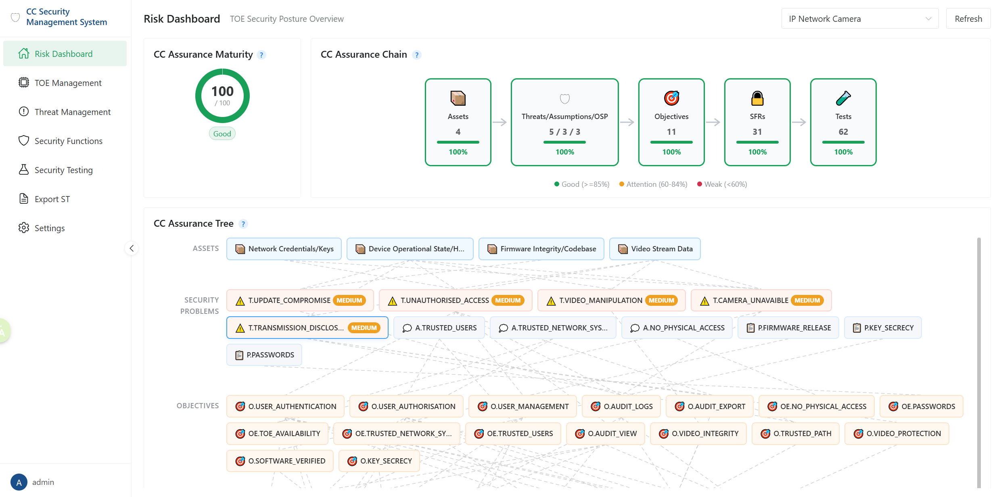
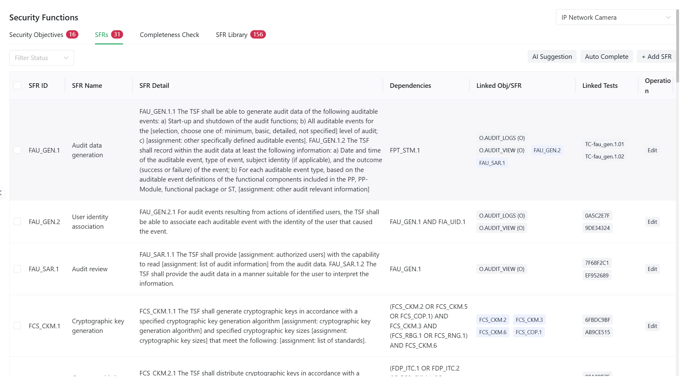
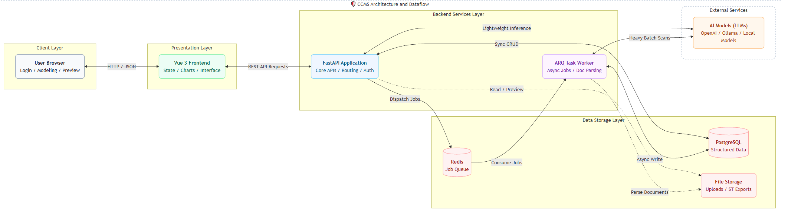

# CCMS — Common Criteria Management System

[](LICENSE)
[](https://v3.vuejs.org/)
[](https://fastapi.tiangolo.com/)
[](https://www.python.org/)

CCMS is a security evaluation and management system for IT products, built around the Common Criteria (ISO/IEC 15408) standard. It is designed for:
- Users who need to put a product through CC certification, by providing a streamlined, end-to-end content workflow;
- Companies and teams who want to bring CC thinking into their product security governance — inventorying assets, identifying threats, defining security objectives, deriving Security Functional Requirements (SFRs), and designing a complete set of test cases.

> **💡 Key highlight**: Deep AI integration (fully compatible with the OpenAI protocol as well as self-hosted local models). Provides intelligent assistance across the whole chain — from asset inventory and threat modeling to automated generation of the Security Target (ST) document.

Before you dive in, we strongly recommend reading the short CC introduction first — it will give you a solid conceptual foundation.

## 🌟 Feature Showcase (Risk Dashboard)

The system's Risk panel provides a comprehensive, multi-dimensional view of the product's current Assurance Chain, security functions and dependencies, ST export, and more. This is the core visual and functional showcase of CCMS:

Live demo: http://kafroc.cloud-ip.cc/   (The VPS is modest; if the page is slow or unreachable, please retry later.)



---

## About Common Criteria (CC)
See [CC Introduction](docs/docs/cc-introduction.md)

## Project vision and origin

Traditional CC certification tends to come with opaque standard clauses and steep compliance/time costs. CCMS was born not only to help IT products pursue strict CC certification, but — more importantly — to help more engineering teams actually practice CC's security philosophy in a relatively light, intuitive way, through systematic, engineered best practices.

Thanks to increasingly mature Large Language Model (LLM) technology, CCMS is able to dissolve the "arcane and niche" stereotype around CC. We are not selling "certification"; we are building a rigorous, formally-justifiable security management toolbox that meaningfully raises the overall security waterline of IT products.


## 🚀 Deployment and Running

> **⚠️ AI prerequisite**: For the full intelligent modeling experience (asset suggestions, defect scanning, test-case generation, etc.), we strongly recommend configuring a working AI model endpoint (OpenAI, Ollama, vLLM, or any OpenAI-compatible service) immediately after starting the system.

Two installation modes are supported: Docker, and running from source. A minimal automated script is provided for Linux environments; Docker is the recommended path.

### Install and start the services

On Linux, enter the project root directory and run the environment-initialization script first, following the prompts:

```bash
./Install_for_Linux.sh
```

Once the environment is ready, pick the mode you want and the script will bring up all services:

```bash
./RUN.sh          
# Or specify the mode explicitly:
./RUN.sh up docker
./RUN.sh up local
```

#### Verifying the start-up

> The ports are controlled by `FRONTEND_PORT` (default `8080`) and `BACKEND_PORT` (default `8000`) in `.env`. Both startup modes use the same addresses.

**1. Backend health check** — `{"status":"ok"}` means the backend is ready.

```bash
curl http://localhost:8000/api/health
# In the cloud, replace localhost with your server IP or domain, and use the BACKEND_PORT value.
```

**2. Frontend URL**

```
http://localhost:8080/
# If FRONTEND_PORT is set to 80, open http://localhost/ directly.
# Remote access: http://<server-ip-or-domain>:8080/

After installation, a default admin user is pre-seeded. The initial password is Admin@123456, and the first login will force a password change.
```

**3. Stopping the services**

```bash
./RUN.sh down docker   # Docker mode
./RUN.sh down local    # Local mode
```

### Environment variables

Before the first deployment, copy `.env.example` to `.env` and fill in the values for your environment:

| Variable | Description | Production requirement |
| --- | --- | --- |
| `APP_ENV` | `development` or `production`. Production mode runs strict validation at startup. | `production` |
| `SECRET_KEY` | JWT signing key. At least 32 characters; cannot be the placeholder default. | **Required** |
| `ENCRYPTION_KEY` | Encryption key used to store AI API keys at rest. **Required in production**. In development, if unset, the key is derived from `SECRET_KEY` (functional, but not recommended). | **Required in production** |
| `ALLOWED_ORIGINS` | Comma-separated list of front-end origins allowed via CORS. | **Required**, must not be `*` |
| `ADMIN_INITIAL_PASSWORD` | Initial admin password. Default: `Admin@123456`. | **Change promptly** |
| `DATABASE_URL` / `SYNC_DATABASE_URL` | PostgreSQL connection strings. | **Required** |
| `REDIS_URL` | Redis connection string (used by the ARQ task queue). | **Required** |
| `STORAGE_PATH` | Upload storage directory. | Volume mount recommended |
| `MAX_UPLOAD_SIZE_MB` | Maximum per-file upload size. | As needed |
| `BACKEND_HOST` | Backend bind address. `0.0.0.0` allows remote access, `127.0.0.1` restricts to localhost. | Use `0.0.0.0` for cloud deployments |
| `BACKEND_PORT` | Backend port (same for Docker and local mode). | Default `8000` |
| `FRONTEND_PORT` | Front-end public port (same for Docker and local mode). Default `8080`; can be set to `80` in production (requires root on Linux, or run under Docker). | Default `8080` |

> Both Docker and local (`RUN.sh up local`) modes share the same `FRONTEND_PORT` / `BACKEND_PORT`, so the final access URL is identical in both cases (e.g. `http://your-host:8080/`). For cloud deployments, keep `BACKEND_HOST=0.0.0.0` and put your real domain into `ALLOWED_ORIGINS` to allow remote access.

**Production startup checks**: when `APP_ENV=production`, the backend validates all of the following at startup — if any one of them fails, it will **refuse to start** and print the reason:

- `SECRET_KEY` is not a weak value and is at least 32 characters long
- `ENCRYPTION_KEY` is set and non-empty
- `ALLOWED_ORIGINS` is set and non-empty (and not `*`)
- `ADMIN_INITIAL_PASSWORD`, if set, is not a well-known weak password (leaving it unset so the system auto-generates one is recommended)


---

## ⏱️ 5-Minute quick-start path

Once the services are running, the shortest path to feel the end-to-end flow is:

1. **Log in**: Sign in with the `admin` account. The initial password is `Admin@123456`; the first login will force a password change.
2. **Import a TOE**: The repository ships with an `IP Network Camera.toe` sample — users can import it directly and immediately experience a complete, pre-populated TOE.
3. **Basic setup (critical)**: Go to the `Settings` page, switch the UI language to the one you prefer, **add a usable AI model configuration** and set it as the current working model to unlock the full suite of generation and scanning features. Example with NVIDIA's hosted models: API Base URL `https://integrate.api.nvidia.com/v1`; Model Name `minimaxai/minimax-m2.5`; paste your API key. Click "Validate", and once validation passes, click "Set as working model" — the AI model is now ready.
4. **Build the TOE (Target of Evaluation)**: Go to the `TOE` module, create a new product under evaluation, fill in the physical / logical boundaries and core usage scenarios, and upload architecture diagrams or other supporting materials.
5. **Threat analysis**: For the TOE assets you just configured, use AI scanning or manual entry to populate Threats, Assumptions, and Organizational Security Policies (OSPs).
6. **Security objectives**: Define Security Objectives, map them to the corresponding security problems, and use AI recommendations to complete the SFRs (Security Functional Requirements) in line with the CC standard.
7. **Import the official SFRs**: The repository ships with `SFRs of CC2022.csv` — on the Security page, use SFR Library to import the official SFRs.
8. **Verify coverage (Tests)**: For the mapped SFRs, attach or auto-generate test cases, and verify that the product's security defenses have no gaps.
9. **Risk review and one-click export**: Use the dashboard to surface blind spots and the completeness score of the assurance chain, then go to the `Export` page and preview or download a standard ST document in Markdown / Word format.


## Tech stack and architecture

The project uses a decoupled front-end / back-end architecture. Its core goal is not simple form entry, but stringing together CC modeling, evidence artifacts, AI-assisted analysis, completeness checking, and ST delivery into a single executable chain.

### Architecture and stack at a glance



**Tech stack**

| Layer | Primary technologies | Notes |
| --- | --- | --- |
| Frontend | Vue 3, TypeScript, Vite, Vue Router, Pinia, Naive UI | Pages, state, routing, and interactive components |
| Visualization | ECharts, Vue-ECharts | Risk distribution, completeness radar, assurance-chain visualizations |
| Document rendering | Markdown-it | ST preview and Markdown editing mode |
| Backend | FastAPI, Uvicorn | REST API and asynchronous endpoints |
| Data layer | SQLModel, SQLAlchemy, PostgreSQL, asyncpg | Business objects, relational mapping, async access |
| Task queue | ARQ, Redis | Handles AI and other long-running tasks |
| AI integration | OpenAI-compatible SDK | Supports OpenAI-protocol models, Ollama, and any compatible service |
| Document processing | pypdf, pdfplumber, python-docx | PDF / Word document parsing and export |
| Deployment | Docker Compose, Nginx | One-command orchestration and production reverse proxy |


### Tests
If you modify the source code, run the test suite afterwards to make sure nothing has broken.

Backend unit and API tests (pytest + in-memory / file SQLite — no real Postgres or Redis required):

```bash
cd backend
pip install pytest pytest-asyncio httpx aiosqlite
python -m pytest ../test/backend/ -v
```

Frontend unit tests (vitest):

```bash
cd frontend
npm install
npm test
```


## Detailed feature reference
See [CCMS Full Features](docs/full-features.md)


## Contact and Support
### Contact
- `Author email`: kafrocyang@gmail.com
- `Bug reports`: Please file an Issue on the repository, preferably with reproduction steps, screenshots, logs, and environment details.
- `Feature requests`: In the Issue, please describe your business context, the problem you're trying to solve, and why the current flow is not enough.
- `Code contributions`: Pull Requests are very welcome — ideally accompanied by screenshots, API notes, or test notes.
- `Case-study exchange`: If you have sanitized ST / PP / SFR samples, project templates, or process artifacts, contributing them as reference input to improve this system is warmly welcomed.

### Support / Donations
- This project represents a lot of personal effort, developed and maintained over a long period as open source. I was recently impacted by a layoff and am currently looking for new opportunities.

- If CCMS has saved you real time on project evaluation, asset inventory, or day-to-day security management — or if you value the security reasoning behind it — a small gesture of support would mean a great deal. Every contribution helps not just materially, but as meaningful encouragement for me to keep focused on open-source work through this career transition and to keep improving the project. Thank you.

- <a href='https://ko-fi.com/S6S21XTMFB' target='_blank'></a><br>

## Star History

[](https://star-history.com/#kafrocyang/cc-security&Date)
