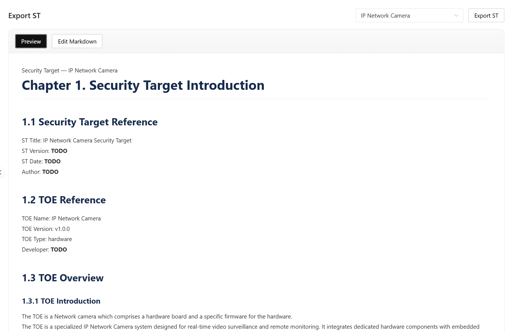

# CCMS 安全管理系统 (Common Criteria Management System)

[](LICENSE)
[](https://v3.vuejs.org/)
[](https://fastapi.tiangolo.com/)
[](https://www.python.org/)

CCMS 是一个基于 Common Criteria (ISO/IEC 15408) 标准，面向IT产品的安全评估与管理系统。适用于：
- 要对产品开展 CC 认证的用户，提供便利化的内容闭环管理；
- 期望引入 CC 理念来进行产品安全治理的公司/团队，包括梳理资产、识别威胁、定义安全目标与推导安全功能需求 (SFR)，设计完备的测试用例。

> **💡 核心亮点**：深度整合 AI 能力支持（全面兼容 OpenAI 协议模型及本地大模型），提供从资产梳理、威胁建模到 ST（Security Target）文档自动化生成的全链路智能化辅助。

在深入体验本系统前，强烈建议您先阅读 CC 简介，这将为您构建良好的理论基础。

## 🌟 核心功能展示 (Risk Dashboard)

系统的 Risk 面板能够全方位、多维度地为您展示产品当前的安全保障链路 (Assurance Chain)、安全功能和依赖梳理、ST文档导出等功能。这是 CCMS 的核心视觉与能力展现：

演示网站：http://kafroc.cloud-ip.cc/  （因为VPS性能较差，卡顿或无法访问请稍后重试。）




---

## CC(Common Criteria) 简介
请查看 [CC简介](docs/CC简介.md)


## 项目愿景与起源

传统的 CC 认证往往伴随着晦涩难懂的标准条款和高昂的合规时间成本。CCMS 的诞生，不仅为了辅助那些需要通过严格 CC 认证的 IT 产品，更希望通过系统化、工程化的最佳实践，让更多的研发团队能以相对轻松、直观的方式践行 CC 的安全哲学。

借助日趋成熟的大语言模型 (LLM) 技术，CCMS 能够化解 CC 标准“高深冷门”的刻板印象。我们并不推销“认证”本身，而是致力于提供一种逻辑严密、可被形式化证明的安全管理工具箱，显著拉升IT产品的整体安全水位。


## 🚀 部署与运行

> **⚠️ AI 环境前置配置**：为了获得完整的智能化建模体验（如资产建议、缺陷扫描、测试用例生成等），强烈建议您在启动系统后，首先配置有效的 AI 模型接口（如 OpenAI、Ollama、vLLM 等兼容大模型的服务）。

目前支持两种安装模式：Docker 和源码直接运行。系统目前提供了 Linux 环境下的极简自动化脚本，建议优先使用Docker安全和启动。

### 环境安装与服务启动

在 Linux 环境，进入项目主目录，首先根据脚本提示完成环境初始化：

```bash
./Install_for_Linux.sh
```

安装就绪后，选择您期望的启动方式即可拉起所有服务：

```bash
./RUN.sh          # 交互式选择启动模式（推荐：Docker）
# 或指定模式：
./RUN.sh up docker
./RUN.sh up local
```

#### 启动后验证

> 端口由 `.env` 中的 `FRONTEND_PORT`（默认 `8080`）和 `BACKEND_PORT`（默认 `8000`）控制，两种启动模式地址完全一致。

**1. 后端健康检查**（返回 `{"status":"ok"}` 说明后端就绪）

```bash
curl http://localhost:8000/api/health
# 云端替换 localhost 为服务器 IP 或域名，端口改为 BACKEND_PORT 的值
```

**2. 前端访问地址**

```
http://localhost:8080/
# 若 FRONTEND_PORT 设为 80，则可直接访问 http://localhost/
# 云端访问：http://<服务器IP或域名>:8080/

安装好之后，默认内置admin用户，初始化密码是Admin@123456，首次登陆会强制要求修改密码。
```

**4. 停止服务**

```bash
./RUN.sh down docker   # Docker 模式
./RUN.sh down local    # 本地模式
```

### 环境变量说明

首次部署前，请将 `.env.example` 复制为 `.env` 并按环境填写：

| 变量 | 说明 | 生产环境要求 |
| --- | --- | --- |
| `APP_ENV` | `development` 或 `production`；生产模式下会在启动时做严格校验 | `production` |
| `SECRET_KEY` | JWT 签名密钥，至少 32 字符，不能使用默认占位值 | **必填** |
| `ENCRYPTION_KEY` | AI API Key 落盘加密密钥。**生产环境必填**；开发环境未设置时退化为用 `SECRET_KEY` 派生（功能可用，但不推荐）。 | **生产必填** |
| `ALLOWED_ORIGINS` | 允许跨域访问的前端地址，逗号分隔 | **必填**，不得为 `*` |
| `ADMIN_INITIAL_PASSWORD` | 初始管理员密码，默认为Admin@123456 | **及时修改** |
| `DATABASE_URL` / `SYNC_DATABASE_URL` | PostgreSQL 连接串 | **必填** |
| `REDIS_URL` | Redis 连接串（ARQ 队列使用） | **必填** |
| `STORAGE_PATH` | 上传文件落盘目录 | 建议使用卷挂载 |
| `MAX_UPLOAD_SIZE_MB` | 单文件上传体积上限 | 按需 |
| `BACKEND_HOST` | 后端监听地址。`0.0.0.0` 允许远程访问，`127.0.0.1` 仅本机 | 云端部署使用 `0.0.0.0` |
| `BACKEND_PORT` | 后端端口（docker 与本地模式一致） | 默认 `8000` |
| `FRONTEND_PORT` | 前端对外端口（docker 与本地模式一致）。默认 `8080`；生产环境可改为 `80`（Linux 需 root 或 Docker） | 默认 `8080` |

> Docker 与本地（`RUN.sh up local`）两种启动方式使用同一组 `FRONTEND_PORT` / `BACKEND_PORT`，因此最终访问地址完全一致（例如 `http://your-host:8080/`）。云端部署只需把 `BACKEND_HOST` 留为 `0.0.0.0` 并在 `ALLOWED_ORIGINS` 中填入真实域名，即可远程访问。

**生产模式启动校验**：`APP_ENV=production` 时后端会在启动时检查以下条件，任意一项不满足则**拒绝启动**并打印原因：

- `SECRET_KEY` 不是弱口令且长度 ≥ 32 字符
- `ENCRYPTION_KEY` 已设置且非空
- `ALLOWED_ORIGINS` 已设置且不为空（不允许 `*`）
- `ADMIN_INITIAL_PASSWORD` 若有值，不能是已知弱密码（建议留空由系统生成）


---

## ⏱️ 5 分钟极速体验路径

如果您已成功启动服务，可通过以下最短路径感受系统的全链路闭环逻辑：

1. **登录系统**：使用管理员账号 `admin` 登录。初始密码为`Admin@123456`；首次登录后系统会强制要求修改密码。
2. **导入TOE**: 仓库默认自带一个IP Network Camera.toe，用户可直接导入，预先体验完整的TOE信息。
3. **基本配置 (关键)**：进入 `设置` 页面，将界面语言切换为您习惯的语言；**新增一个可用的 AI 模型配置**并将其设为当前工作模型，以解锁全套生成与扫描功能。以Nvidia提供的模型为例：API Base URL：https://integrate.api.nvidia.com/v1 ； Model Name：minimaxai/minimax-m2.5 ； API key保持好，配置好后，点击“验证”，验证通过，点击“设为工作模型”，这样AI模型就配置好了。
4. **构建 TOE (评估对象)**：进入 `TOE` 模块，新建受评产品，录入物理/逻辑边界与核心使用场景，并上传架构图档或其他支撑材料。
5. **威胁分析 (Threats)**：围绕刚才配置的 TOE 资产，使用 AI 扫描或人工录入相关的威胁 (Threats)、假设 (Assumptions) 和组织安全策略 (OSPs)。
6. **安全目标 (Security)**：建立相应的安全目标 (Security Objectives)，将其映射至对应的安全问题，并在此基础上获取 AI 推荐，补全符合 CC 标准的 SFR (安全功能要求)。
7. **导入官方SFR**: 仓库默认自动SFRs of CC2022.csv，用户可以在安全功能页面，SFR Library导入官方SFR。
8. **验证覆盖 (Tests)**：为已映射的 SFR 对接或自动生成测试用例，校验产品的安全防护逻辑是否存在断层。
9. **风险评审与全景导出 (Risk & Export)**：通过看板排查盲区提示及保障链路的完整分值，最终在 `Export` 页面中一键预览或下载标准的 ST Markdown / Word 文档。


## 技术栈与架构设计

这个项目采用前后端分离架构，核心目标不是单纯做表单录入，而是把 CC 建模、证据资料、AI 辅助分析、完整性检查和 ST 交付串成一条可执行链路。

### 架构与技术栈速览


**技术栈**

| 层次 | 主要技术 | 说明 |
| --- | --- | --- |
| 前端 | Vue 3、TypeScript、Vite、Vue Router、Pinia、Naive UI | 负责页面、状态、路由与交互组件 |
| 可视化 | ECharts、Vue-ECharts | 用于风险分布、完整性雷达、保障链可视化 |
| 文档渲染 | Markdown-it | 用于 ST 预览与 Markdown 编辑模式 |
| 后端 | FastAPI、Uvicorn | 提供 REST API 与异步接口 |
| 数据层 | SQLModel、SQLAlchemy、PostgreSQL、asyncpg | 管理业务对象、关系映射与异步访问 |
| 任务队列 | ARQ、Redis | 承接 AI 和其他耗时任务 |
| AI 集成 | OpenAI SDK 兼容接口 | 支持 OpenAI 协议模型、Ollama 或其他兼容服务 |
| 文档处理 | pypdf、pdfplumber、python-docx | 处理 PDF / Word 文档解析与导出 |
| 部署 | Docker Compose、Nginx | 提供一键编排与生产代理入口 |


### 测试用例
如果需要对源码做改动，可以在改动后执行用例确保功能都正常。

后端单元与接口测试（基于 pytest + 内存/文件 SQLite，不依赖真实 Postgres/Redis）：

```bash
cd backend
pip install pytest pytest-asyncio httpx aiosqlite
python -m pytest ../test/backend/ -v
```

前端单元测试（基于 vitest）：

```bash
cd frontend
npm install
npm test
```


## 详细功能说明
请查看 [详细功能说明](docs/详细功能说明.md)


## 联系方式与捐助
### 联系方式
- `作者邮箱`：kafrocyang@gmail.com
- `Bug 反馈`：优先通过仓库 Issue 提交，并尽量附上复现步骤、截图、日志和环境信息。
- `功能建议`：建议在 Issue 中说明你的业务背景、希望解决的问题，以及为什么现有流程不够用。
- `代码贡献`：欢迎直接提交 Pull Request，最好同时补上截图、接口说明或测试说明。
- `案例交流`：如果你手上有脱敏后的 ST / PP / SFR 样例、项目模板或流程实践，非常欢迎作为经验输入一起完善这个系统。

### 捐助
- 本项目是我倾注了大量心血开发并长期维护的开源成果。近期我遭遇了岗位裁撤，目前正处于寻找新工作机会的阶段。

- 如果 CCMS 在您的项目评估、资产梳理或日常安全管理中为您切实节省了时间，或者您认可这套安全逻辑的价值，欢迎给予一点小小的支持。您的每一份赞助对我而言不仅是物质上的帮助，更是支持我在职业过渡期继续专注于开源创作、不断完善这个项目的巨大动力！非常感谢。

- <a href='https://ko-fi.com/S6S21XTMFB' target='_blank'></a><br>

## Star History

[](https://star-history.com/#kafrocyang/cc-security&Date)
