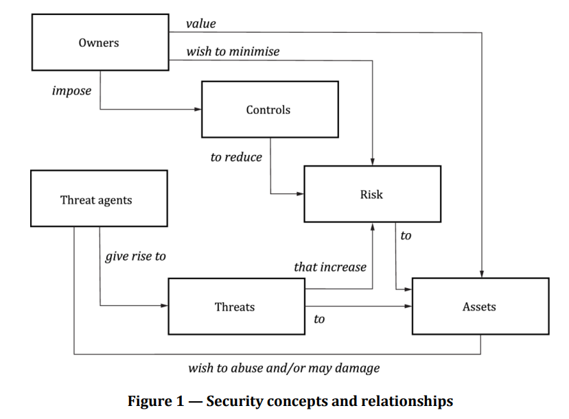
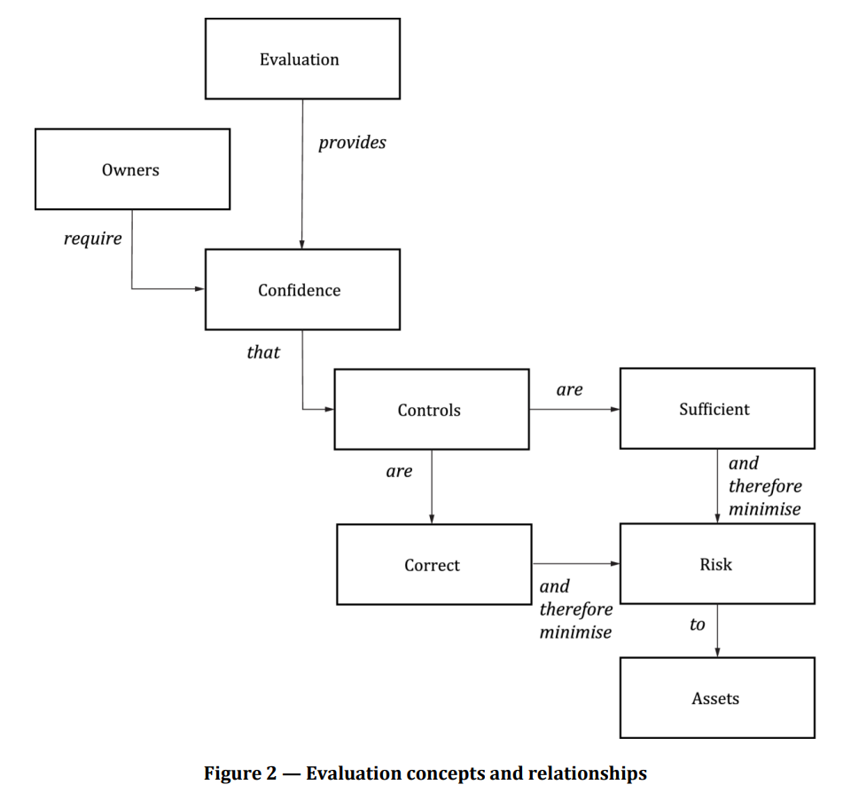

## About Common Criteria (CC)

Common Criteria (CC, formally ISO/IEC 15408) is the international standard for IT security evaluation. It is often called the "common language" or "measuring stick" of information security — it defines a unified, objective, quantifiable framework for evaluating the security functions and assurance measures of IT products.
Common Criteria (ISO/IEC 15408) is the most widely mutually-recognized standard in global information security, and is considered the authoritative security evaluation benchmark by governments, the military, and the financial sector worldwide.
- **Website**: [www.commoncriteriaportal.org](https://www.commoncriteriaportal.org/)
- **Mutual recognition (CCRA)**: 31 countries have signed the CCRA agreement, enabling "evaluate once, recognized worldwide."
- **Industry adoption**:
  - **Apple**: Their iOS, macOS, and the **Secure Enclave** in M-series chips are kept under active CC certification.
  - **Google**: The **Titan M2** security chip in **Pixel** phones is certified under CC PP0084.
  - **Others**: **Microsoft Windows 11**, **Samsung Knox**, and **Cisco** core networking equipment all treat CC certification as a must-have qualification for entering the high-end market.

### Glossary
| Term | Full name | Definition |
| :--- | :--- | :--- |
| **TOE** | Target of Evaluation | The IT product or system that is being evaluated — the subject of the security audit. |
| **ST** | Security Target | The Security Target document. Written by the developer, it defines the security requirements, assurance measures, and environmental boundaries for a specific TOE. |
| **PP** | Protection Profile | A generic security-requirements template, published by industry bodies or governments, that sets the baseline a class of products (e.g. firewalls) must meet. |
| **SPD** | Security Problem Definition | A statement of the Threats, Organizational Security Policies (OSPs), and Assumptions that apply to the TOE and its operational environment. |
| **SFR** | Security Functional Requirements | Components selected from Part 2 of the CC standard — the "templates" for security functional requirements. |
| **SAR** | Security Assurance Requirements | Components selected from Part 3 of the CC standard — they govern *how* a product is developed and verified (e.g. code audit, penetration testing). |
| **EAL** | Evaluation Assurance Level | A level from EAL1 to EAL7 indicating the rigor and confidence of the evaluation of the product's security features. |
| **Operational Environment** | — | The external environment a TOE needs to run in. Usually framed through OE Objectives (environmental security objectives). |

### The security philosophy behind CC
When we sell an IT product to a customer, it is genuinely hard to explain *why* the product is safe in a way the customer can trust.
The CC standard provides a rigorous, logical argument for how to build a secure product — so that even customers who are not security experts can gain confidence from the fact that the product has passed CC evaluation.

All security activity is anchored on **assets**. Every asset has an owner. Threat agents pose threats to assets, which increases the risk exposure of those assets. The owner's goal is to eliminate, reduce, or transfer that risk through countermeasures.

The asset owner wants the risk to remain acceptable — that is, to have sufficient confidence in the asset's security. CC evaluation is what reinforces that confidence. Reducing risk requires controls, and CC works by proving two things: the **sufficiency** of the controls (the controls cover the risk), and the **correctness** of their implementation (the controls are actually implemented as claimed). Once both sufficiency and correctness have been demonstrated, the product can — in theory — be considered secure.

Note: Asset inventory and threat identification are not mathematical formulas; there is real subjective space in them. Strictly speaking, passing CC certification does **not** guarantee a product is 100% secure or vulnerability-free — that interpretation is wrong. CC is largely a form of **formal proof**: logically sound, but security is a dynamic adversarial process — attack techniques evolve, and the asset scope shifts over time. The real value of CC is **significantly raising the security waterline**, not guaranteeing zero vulnerabilities.

The CC security logic chain:
- The TOE has assets → those assets face security threats → to counter the threats, security objectives must be defined → to meet the objectives, security functions (SFRs) must be specified.
- Then if the security functions are implemented correctly → the objectives are met → the threats are mitigated → the assets are protected.